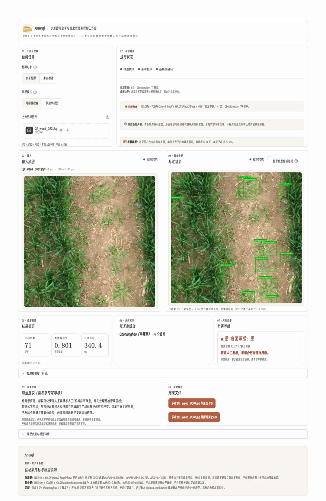

<!-- README.md -->
# 小麦田间杂草与害虫智能识别及辅助决策系统

小麦田间杂草（1 类）与害虫（32 类）双任务识别工作台：本地 Streamlit Web 应用，杂草侧 YOLO11s + YOLOX-Dinov3 Small/Base 异构 WBF 融合，害虫侧 YOLO11m/l/s 三模型 refined classwise WBF；输出检测框、类别统计、危害等级与防治方向建议（原型规则），支持标注 JPG 与结构化 JSON 导出。

推理、融合与规则算法沿用已通过真实 CLI / Web 验证的实现（封装层采用整体复制基线 + 增量包装，不重写已验证算法；模块溯源见各文件头注释与 `THIRD_PARTY_NOTICES.md`）。

<p align="center"></p>

**完整运行资产**：四套 YOLO11 系权重与训练/验证数据集通过 GitHub Release（tag `assets-v1`）提供；两套 DINOv3 衍生权重作为本地运行资产单独管理（见 §7.2）。各资产按各自来源条款管理，不适用项目 MIT 许可证。下载、校验与放置方法见 §7.2，许可边界详见 `THIRD_PARTY_NOTICES.md` 与 `LICENSE-BOUNDARY.md`。

> **核心能力概览**：杂草 / 害虫双任务识别 · 高精度融合模式 / 快速单模型模式 · 检测框 / 类别统计 / 危害等级 / 防治方向建议 · 标注 JPG 与结构化 JSON 导出 · 字体与图标本地化，离线可用

## 1. 项目简介

本项目面向小麦田间生产场景，将"识别"进一步延伸至"识别 → 辅助决策"：用户上传田间图像后，系统给出检测框、按类别统计、基于密度的危害等级与防治方向建议，并可导出标注图与结构化 JSON 供后续系统使用。

- 杂草任务：YOLO11s（快速单模型）与 YOLO11s + YOLOX-Dinov3 Small/Base 异构 WBF 融合（高精度融合）两条推理路径；
- 害虫任务：YOLO11m（快速单模型）与 YOLO11m + YOLO11l + YOLO11s 三模型 refined classwise WBF 融合（高精度融合）两条推理路径；
- 全部指标与结论均为本地验证集口径，不代表对任意上传图片的精度承诺。

## 2. 核心能力

- 支持杂草与害虫两类检测任务，用户可主动切换检测对象。
- 两种推理模式：**高精度融合模式**（多模型加权框融合 WBF）与**快速单模型模式**（单一权重直接推理）。
- JPG/JPEG/PNG 上传，单批最多 10 张，单张最大 20 MB。
- 检测框、按类别统计、坐标明细、危害等级、防治方向建议。
- 标注 JPG + 结构化 JSON 导出。
- 高精度融合模式显存不足（CUDA OOM）时自动释放模型缓存，并支持一键切换快速单模型模式重试。
- 无 CUDA 环境仍可启动并执行推理，但性能有限，建议使用快速单模型。
- 任务切换时释放另一任务模型与 CUDA 缓存。

## 3. 当前页面 UI

当前页面采用 Bento 网格布局（珊瑚色浅底、编号卡片）。以下为杂草检测（高精度融合模式）的真实运行全页截图：

<p align="center"></p>

页面各区域：

- 顶部品牌栏（小麦田图标 + 站点标题）；行 1「01 · 工作台控制」（检测对象 / 推理模式 / 上传）+「02 · 运行状态」（模型就绪等状态点、模式信息条、原型声明、批量规则）；
- 行 2「输入原图」+「标注结果」（含显示低置信候选框开关）；行 3「结果概览 KPI」+「按类别统计」+「危害等级」；
- 行 4「检测框明细」（可折叠）；行 5「防治建议」+「结果导出」（标注 JPG / JSON 下载）；行 6「推理参数与模型详情」（可折叠）；页脚为验证集指标与模型说明。

表现层事实：

- 全站使用本地得意黑（Smiley Sans）与宋体两套字体；字体文件随仓库提供，离线可用；
- 浏览器标签页图标与品牌栏图标使用小麦田插画（`static/wheat-icon-128.png` / `-64.png`）；
- 字体与图标由 Streamlit 静态服务提供（`.streamlit/config.toml` 中 `enableStaticServing = true`）；
- 上传控件文案与服务端限制一致（`maxUploadSize = 20`，单张 ≤20 MB）；
- 无结果时显示带编号三步引导的空状态卡；展示层低置信过滤（< 0.10）仅影响标注图与明细表默认显示，危害等级 / 类别统计 / JSON 始终基于全部检测结果；
- 危害等级与防治建议仍为原型规则，需农学专家校准，不构成正式农业处方。

## 4. 项目结构

```text
WheatFieldAI/
├─ app.py
├─ config.yaml
├─ requirements.txt
├─ LICENSE / LICENSE-BOUNDARY.md / THIRD_PARTY_NOTICES.md
├─ .streamlit/config.toml     ← 主题 + 上传限制 + 静态服务开关
├─ static/                    ← 本地字体、品牌图标与字体许可文件
├─ src/                       ← 推理与业务模块
├─ scripts/                   ← 验证脚本
├─ configs/                   ← 类别唯一真源与 classwise WBF 配置
├─ packaging/                 ← 启动器与检查脚本
├─ docs/DEPLOYMENT.md         ← 日志 / 端口 / 现场恢复 / 打包计划
└─ test_images/README.md      ← 验收样例说明（样例图片自备；完整训练/验证数据集经 Release 提供）
```

src/ 各模块沿用已验证的推理实现（溯源见各文件头注释与 THIRD_PARTY_NOTICES.md）；deployment_adapter.py 只提供封装接口，不实现新的推理算法。运行时生成的 models/、logs/、outputs/ 已被 .gitignore 排除，不随代码树分发（models/ 权重与训练/验证数据集经 Release 资产提供，见 §7.2）。

## 5. 环境要求

已验证环境基线：

```text
Python 3.13.9
PyTorch 2.11.0+cu128
torchvision 0.26.0+cu128
CUDA 12.8
Streamlit 1.59.1
Ultralytics 8.4.81
opencv-python 5.0+
numpy 2.4+
Pillow 12+
pandas 2.3+
```

CUDA 版 PyTorch 单独安装：

```text
python -m pip install torch==2.11.0+cu128 torchvision==0.26.0+cu128 --index-url https://download.pytorch.org/whl/cu128
python -m pip install -r requirements.txt
```

以上为当前已验证环境基线，不代表这些依赖版本均为最低兼容版本。

启动器和检查脚本不会自动安装依赖，也不会联网。

## 6. 启动

推荐：

```text
.\packaging\start.bat
```

或：

```text
powershell -ExecutionPolicy Bypass -File .\packaging\start.ps1
```

手动：

```text
python -B -m streamlit run app.py --server.port 8501 --server.headless true
```

默认：

```text
http://localhost:8501
```

config.yaml 路径支持相对路径（以项目根为基准）与环境变量绝对路径覆盖。环境变量：

```text
WHEATWEED_YOLO11_WEIGHTS
WHEATWEED_YOLOX_SMALL_WEIGHTS
WHEATWEED_YOLOX_BASE_WEIGHTS
PEST_YOLO11M_WEIGHTS
PEST_YOLO11L_WEIGHTS
PEST_YOLO11S_WEIGHTS
PEST_DATASET_YAML
PEST_CLASSWISE_CONFIG
WHEATWEED_DEVICE
WHEATWEED_PORT
```

相对路径由 `src/config.py` 统一解析为基于项目根目录的绝对路径。端口冲突与修改方法见 `docs/DEPLOYMENT.md`。

## 7. 模型与数据资产

### 7.1 模型清单

| 任务 | 模型 | 文件（models/ 下） | 用途 |
|---|---|---|---|
| 杂草 | YOLO11s | `weed/yolo11s/baseline_best.pt` | 快速单模型 / 融合成员 |
| 杂草 | YOLOX-Dinov3 Small | `weed/dinov3_small/best_ckpt.pth` | 高精度融合成员 |
| 杂草 | YOLOX-Dinov3 Base | `weed/dinov3_base/best_ckpt.pth` | 高精度融合成员 |
| 害虫 | YOLO11m | `pest/yolo11m/best.pt` | 快速单模型 / 融合成员 |
| 害虫 | YOLO11l | `pest/yolo11l/best.pt` | 高精度融合成员 |
| 害虫 | YOLO11s | `pest/yolo11s/best.pt` | 高精度融合成员 |

类别与融合配置（随仓库提供）：`configs/dataset.yaml`（害虫 32 类类别名唯一数据源）、`configs/classwise_ensemble_11m11l11s_960_refined_current.json`（refined classwise WBF 参数）。

### 7.2 运行资产与公开下载

四套 YOLO11 系权重与训练/验证数据集通过 GitHub Release（tag `assets-v1`）提供；两套 DINOv3 衍生权重作为本地运行资产单独管理。所有资产按各自来源条款管理，不适用项目 MIT 许可证：

```text
weed_yolo11s_baseline_best.pt             18 MB   Ultralytics YOLO11 训练（AGPL-3.0 路径）
weed_yolox_dinov3_small_best_ckpt.pth    288 MB   本地运行资产，不随 Release
weed_yolox_dinov3_base_best_ckpt.pth     541 MB   本地运行资产，不随 Release
pest_yolo11m_best.pt                     115 MB   Ultralytics YOLO11 训练（AGPL-3.0 路径）
pest_yolo11l_best.pt                     146 MB   Ultralytics YOLO11 训练（AGPL-3.0 路径）
pest_yolo11s_best.pt                      18 MB   Ultralytics YOLO11 训练（AGPL-3.0 路径）
dataset_weed_wheatweed_v1.zip           1.05 GB   杂草 WheatWeed train(3142)+val(787) 图与标注 + 配置
dataset_pest_train_images_v1.part1.zip  ~1.0 GB   害虫训练图片（两卷，解压到同一目录）
dataset_pest_train_images_v1.part2.zip  ~1.0 GB   害虫训练图片（两卷，解压到同一目录）
dataset_pest_labels_splits_v1.zip         13 MB   害虫训练标注 + train/val 划分（相对路径）+ 数据集配置
SHA256SUMS.txt                                    校验公开 Release 资产
```

**DINOv3 衍生权重说明**：`weed_yolox_dinov3_small_best_ckpt.pth` 与 `weed_yolox_dinov3_base_best_ckpt.pth` 基于 Meta DINOv3 lvd1689m 预训练权重微调，构成 DINOv3 License 意义下的衍生作品，按该协议条款分发；协议副本随仓库提供（`licenses/DINOv3-License.md`）。使用限制（贸易管制、禁止军事等终端用途）以协议原文为准，详见 `THIRD_PARTY_NOTICES.md`。

下载后按 `SHA256SUMS.txt` 校验；权重放入 `models/` 对应目录（或用环境变量指定路径）；害虫图片两卷解压到同一目录后与 labels/、splits/ 组合。

数据集资产来自 MADA 平台免费公开数据集（杂草 WheatWeed；害虫训练集，类别体系对应公开学术数据集 IP102），经作者确认可随本项目再分发。

### 7.3 资产校验

```text
python -B packaging/check_models.py
python -B packaging/check_models.py --print-sha256
```

`SHA256SUMS.txt` 用于校验公开 Release 资产；`packaging/model_assets.yaml` 保存六套本地模型权重的真实 SHA-256 前 12 位。路径唯一真源仍然是 config.yaml。

## 8. 32 类类别体系与 WBF

害虫任务的 32 类类别名以 `configs/dataset.yaml` 的 names 段为唯一真源：ID 0..31 连续、共 32 类；代码不自行翻译、不重新排序、不编造类别名。

害虫高精度融合采用按类别配置的 refined classwise WBF：每个类别独立读取模型权重配比、IoU 阈值、跳过阈值与评分策略（来源 `configs/classwise_ensemble_11m11l11s_960_refined_current.json`，必须覆盖全部 0..31），因此不回退到统一默认 WBF 配置，也不复用杂草任务的 WBF 参数。

杂草融合使用固定 WBF 参数（`config.yaml` weed.wbf），与害虫 classwise WBF 相互独立。

## 9. 输出与导出

Web 下载入口（`app.py`）适合交互操作；CLI / 批处理入口（`src/deployment_adapter.py` 的 `export_result()`）适合自动化。两个入口核心字段一致：`detections`、`hazard`、`advice`、`wbf_params`、`class_mapping`、`device`、`note`。

类别体系说明：模型内部类别 ID 与英文类别名以 `configs/dataset.yaml` 为唯一真源；Web 导出的 JSON 在展示层额外提供中文任务标签，不改变模型类别 ID、顺序及内部映射。

`note` 字段为原型声明，必须保留。

## 10. 运行验证

准备真实杂草图和真实害虫图后：

```text
python -B scripts/verify_deployment.py --weed-image "test_images/weed/你的杂草图.jpg" --pest-image "test_images/pest/你的害虫图.jpg"
```

脚本真实加载本地模型，不使用模拟检测结果。覆盖：杂草 fusion / 杂草 yolo11 / 害虫 fusion / 害虫 fast / 缺失权重 / JPG + JSON 导出。

`test_images/weed/` 放置你有权使用的真实杂草田间图片；`test_images/pest/` 放置真实害虫图片；完整训练/验证数据集经 Release 提供（见 §7.2）；不要使用静态截图作为模型真实性验收样本。

## 11. 指标

杂草（本地验证集：787 张图像、2596 个标注框）：

```text
mAP50 = 0.828036
mAP50-95 = 0.443757
AP75 = 0.415953
```

害虫（本地验证集：4330 张图像，refined classwise WBF）：

```text
mAP50 = 0.80524
mAP50-95 = 0.52410
```

均不是平台测试集指标，也不代表对任意上传图片的精度承诺。

## 12. 防治建议与使用边界

当前版本仅提供基于检测结果的原型级风险提示与防治方向建议，不提供具体农药名称、施用剂量、浓度、施用时间、施用次数或安全间隔期等可直接执行的农事处方信息。

重度（高风险）结果建议由农技人员或植保专家进一步复核。危害等级与防治建议由规则模板生成，尚未经农学专家校准，不构成农业防治处方或正式决策依据。

## 13. 常见问题

**权重缺失会怎样？**
缺少权重时状态卡显示「模型未配置」，不会生成模拟框、随机结果或静态 JSON。按 §7.2 下载资产放入 `models/` 后重新检查。

**没有 CUDA 能用吗？**
可以启动并执行推理（CPU 路径），但性能有限，建议使用快速单模型模式；不能将 CPU 模式描述为 GPU 性能。

**显存不足（CUDA OOM）怎么办？**
系统会自动释放模型缓存并提示，界面提供「切换到快速单模型模式并重试」按钮；也可关闭其他占用显存的程序后重试。

**端口被占用？**
默认端口 8501。启动器会先检查端口并给出处理指引；也可设置环境变量 `WHEATWEED_PORT` 换端口。

**日志在哪里？**
启动器自动创建 `logs/`（`streamlit_YYYYmmdd_HHMMSS.log`）。常见关键词与处理见 `docs/DEPLOYMENT.md`。

**现场恢复 / Windows 打包？**
见 `docs/DEPLOYMENT.md`（字节码清理、GPU 显存、端口、PyInstaller 打包计划）。

## 14. 许可证

- 本仓库的项目源代码、脚本、配置与文档以 MIT 许可证发布（见 `LICENSE`）；MIT 的覆盖范围与明确排除项见 `LICENSE-BOUNDARY.md`。
- 第三方组件按各自许可处理，不受项目 MIT 自动覆盖：依赖包与 YOLOX-Dinov3 衍生模型结构（`src/model_config.py`，核验记录见该文件）等逐项说明见 `THIRD_PARTY_NOTICES.md`。
- Ultralytics YOLO11 相关模型与实现受 Ultralytics 许可条款约束；本项目公开发布所采用的 YOLO11 资产按 AGPL-3.0 路径处理，具体边界见 `THIRD_PARTY_NOTICES.md`。
- 得意黑（Smiley Sans）字体随仓库分发，字体本身采用 SIL Open Font License 1.1，版权与许可信息见 `static/FONT-LICENSE.md`；字体不适用项目 MIT。
- 小麦田图标（`static/wheat-icon-*.png`）为项目 UI 资源，经作者确认随仓库分发，纳入项目 MIT 范围。
- 四套 YOLO11 系权重与训练/验证数据集**不在代码树内**：以 Release 资产（tag `assets-v1`）按各自条款提供——YOLO11 系资产按 AGPL-3.0 路径处理；数据集来自 MADA 平台免费公开数据集，作者于 2026-08-31 确认可随本项目再分发。两套 DINOv3 衍生权重作为本地运行资产单独管理，按 DINOv3 License 分发（协议副本见 `licenses/DINOv3-License.md`）。下载与放置见 §7.2。
- 当前**不声称**所有模型 / 数据集许可已完成核验；待核验项与责任人清单见 `THIRD_PARTY_NOTICES.md`。

## 15. 真实性声明

本项目不会使用模拟检测框、静态 JSON、随机结果或占位结果冒充 AI 推理。

真实推理必须依赖真实权重和满足要求的本地运行环境。

本项目已完成开发环境与本地真实推理验证；针对完全陌生目标电脑的环境差异，仍可能需要根据现场 GPU、CUDA、Python 与依赖环境进行调整，启动失败时请参考 `docs/DEPLOYMENT.md` 或使用 §6 的手动启动命令。
